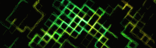
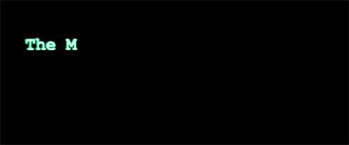

# 🌌 ClockSpace

**ClockSpace** is an elite, premium macOS application that completely redefines the screensaver experience. While the name pays homage to our roots, ClockSpace is a comprehensive marketplace for **all** genres of digital art—from nature vistas and abstract motion to sci-fi digital rain and minimalist clocks. Built with the high-fidelity **CivicEase** design system, it delivers 60-FPS Quartz-rendered graphics straight to your lock screen.

[](https://clockspace.civicease.systems)
[](https://github.com/HARSHRAO729/ClockSpace/releases/latest)

---

## ✅ Status

**ClockSpace v1.0 — the first stable release.** Every screensaver in the catalog is a native, universal (Apple Silicon + Intel), code-signed build that runs on modern macOS. The app stays lightweight and streams its catalog on demand from a fast CDN.

### What's New in v1.0
*   **🖥️ 20 screensavers that actually run on modern macOS**: every one is a universal (arm64 + x86_64), signed build — clocks, generative art, and more.
*   **☁️ New cloud backend**: the catalog now streams from a fast, reliable CDN (Cloudflare R2). The app pulls each screensaver on demand, so it stays small.
*   **✨ Native Swift throughout**: including a brand-new native Word Clock.
*   **🎨 Premium UI**: glassmorphism cards, hover scale, live previews, and dynamic "Apply" buttons, on a clean MVVM architecture.
*   **🔧 Smart installation**: one-screensaver-at-a-time lifecycle, permission banners, success toasts, and deep-link to System Settings.
*   **🧹 Leaner & cleaner**: smaller repository, faster builds, no legacy backend.

**Join the Journey**: We believe in the power of community! If you're a developer or designer passionate about redefining the macOS experience, we warmly invite you to join us as a contributor and help shape the future of ClockSpace.

---

## 🚀 Installation & First Run

Because **ClockSpace** is not yet distributed with an Apple Developer Certificate, macOS will show a warning when you first open it. 

### How to Open (macOS Gatekeeper)
If you see the "Apple could not verify..." message:
1. Open **System Settings** ⚙️ on your Mac.
2. Go to **Privacy & Security**.
3. Scroll down to the bottom where you see *"ClockSpace was blocked..."*
4. Click **Open Anyway** and enter your password.

*You only need to do this once per version!*

---

## ✨ Visual Experience

| Cinematic Previews | Community Favorites | Immersive Motion |
| :---: | :---: | :---: |
|  |  |  |
| *Fluid Transitions* | *Digital Rain* | *Cinematic Loops* |

---

## 🚀 Key Features

*   **Cinematic Marketplace UI**: A flawlessly crafted Glassmorphism and SwiftUI design system with horizontal carousels, dynamic grids, and a full-screen blur focus mode.
*   **Vast Community Catalog**: Over 54 high-quality community-sourced screensavers pre-bundled, ranging from Matrix digital rains to minimalist flip clocks.
*   **Quartz Transformation Engine**: Dynamically compile Swift UI and CoreGraphics code on-the-fly (`swiftc`) directly into executable `.saver` bundles.
*   **One-Click Application**: Streamlined workflow that installs bundles to `~/Library/Screen Savers/` and triggers instant system activation.

---

## 🛠️ Installation & Usage

### Option 1: Run Without Xcode (Recommended)

1.  **Download**: Obtain the latest pre-compiled `.dmg` or `.app` from the [GitHub Releases](https://github.com/HARSHRAO729/ClockSpace/releases) page.
2.  **Launch**: Open the `ClockSpace.app`. You may need to right-click and select **Open** to bypass macOS gatekeeper for the first time.
3.  **Terminal Shortcut**:
    ```bash
    # If the app is in your Applications folder
    open /Applications/ClockSpace.app
    ```

### Option 2: Build from Source (Developers)

1.  Clone the repository: `git clone https://github.com/HARSHRAO729/ClockSpace.git`
2.  Open `ClockSpace.xcodeproj` in Xcode.
3.  Ensure **App Sandbox** is disabled in *Signing & Capabilities*.
4.  Hit **Cmd + R** to run.

---

## 📢 Open Source & Licensing

**ClockSpace is a CivicEase (CVK) project.** 
The brand, design language, and commercial rights are strictly reserved. This project is shared under the **PolyForm Noncommercial License 1.0.0**, which allows for personal, educational, and research use while prohibiting commercial application.

---

## 🤝 Community & Growth

ClockSpace is an open-source project that thrives on community contribution. We have a clear vision for the future and welcome developers of all skill levels.

*   **[Roadmap](ROADMAP.md)**: See what we're building next and where you can help.
*   **[Contributing Guide](CONTRIBUTING.md)**: Learn how to set up the project and submit your first PR.
*   **Good First Issues**: Check our issue tracker for tasks labeled `good-first-issue`.

---

## 📜 Credits & Curation

ClockSpace is built on the shoulders of giants. We curate and showcase some of the best open-source screensavers ever made. 

*   **Aerial**: Cinematic Apple TV screensavers by [John Coates](https://github.com/JohnCoates/Aerial).
*   **Brooklyn**: Abstract Apple animations by [Pedro Carrasco](https://github.com/pedrocarrasco/Brooklyn).
*   **Flurry**: Modern Quartz animations by [Thomas So](https://github.com/thomas-so/Flurry).

*Check the in-app **Credits** page for a full list of projects and original repositories.*

---

*Design with ❤️ by [HARSHRAO729](https://github.com/HARSHRAO729) & the Open Source Community.*
